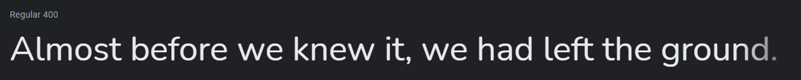

# [Find a Job](https://find-a-job.anniew.xyz/) - a Job Search Dashboard

This is a Job Search Dashboard SaaS Product built using JavaScript.

**LIVE DEMO** - [find-a-job.anniew.xyz](https://find-a-job.anniew.xyz/) OR [find-a-job.netlify.app](https://find-a-job.netlify.app/)

    
    
    
    
    

    

## Table of Contents

- [Design](#design)
  - [Logo](#logo)
  - [Fonts](#fonts)
  - [Color Scheme](#color-scheme)
- [Built With](#built-with)
- [Demo](#demo)
- [Contributing](#contributing)
- [Creator / Maintainer](#creator--maintainer)
- [Acknowledgments](#acknowledgments)

---

## Design

### Logo

Designed and downloaded for free on [FreeLogoDesign](https://www.freelogodesign.org/). _(not sponsored)_

### Fonts

[Poppins](https://fonts.google.com/specimen/Poppins) - logo, titles, and headings

[Nunito](https://fonts.google.com/specimen/Nunito) - all other text

### Color Scheme

- Cultured - logo text, titles, headings, button text
- Sugar Plum - logo, "Find Job" and "Apply Now" buttons, part of the background gradient
- Steel Blue - part of the background gradient
- Slimy Green - button hover
- Eerie Black - header, search bar, and job cards background color
- Raisin Black - job cards hover color
- Davys Grey - "Message" button background color
- Battleship Grey - job description text

---

## Built With

- [HTML5](https://www.w3schools.com/html/)
- [CSS3](https://www.w3schools.com/css/)
- [JavaScript](https://www.w3schools.com/js/DEFAULT.asp)
- Hosted on [Netlify](https://www.netlify.com/)

---

## Demo

---

## Contributing

Pull requests are welcome. For major changes, please open an issue first to discuss what you would like to change. Please make sure to update tests as appropriate.

### How To Contribute

1. Fork the repository to your own Github account.
2. Clone the project to your machine.
3. Create a branch locally with a succinct but descriptive name.
4. Commit changes to the branch.
5. Following any formatting and testing guidelines specific to this repo.
6. Push changes to your fork.
7. Open a Pull Request in my repository.

---

## Creator / Maintainer

Annie Wu ([anniedotexe](https://github.com/anniedotexe))

If you have any questions, comments, or concerns, feel free to contact me below.

  

This project was created for educational purposes and for personal and open-source use.

If you like my content or find this code useful, give it a :star: or support me by buying me a coffee :coffee::heart:

---

## Acknowledgments

- [CleverProgrammer](https://www.cleverprogrammer.com/) for their [SaaS Product using ES6 JavaScript](https://www.youtube.com/watch?v=VjjZ2MaX0Ts) tutorial.
